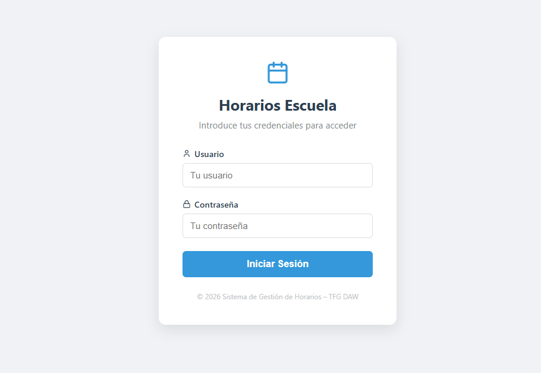
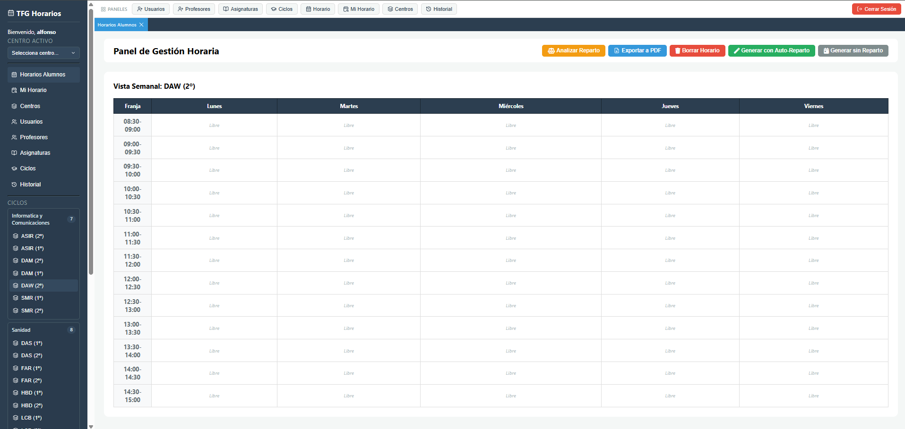
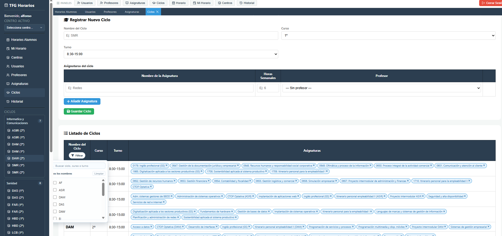
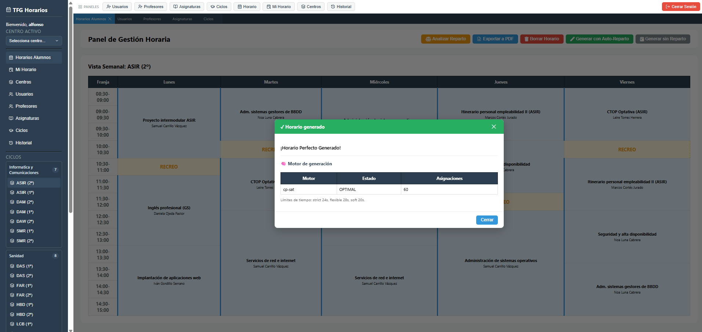
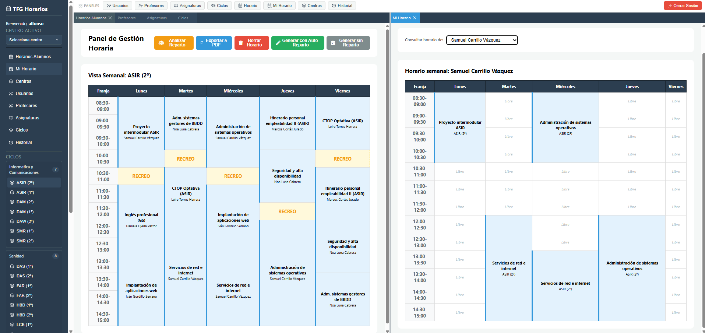

# 📅 Sistema de Gestión y Generación Automática de Horarios

> **TFG (Trabajo Fin de Grado) 2026** — Aplicación Web FullStack para la gestión inteligente de ciclos formativos, asignaturas, profesorado y generación automática de horarios utilizando algoritmos de optimización avanzada.

---

## 🎯 Descripción General

**Sistema inteligente de planificación académica** que automatiza la generación de horarios escolares eliminando conflictos y optimizando la distribución de clases, profesores y aulas en cuestión de segundos.

### El Problema

La planificación manual de horarios es:
- ⏰ **Consumidora de tiempo** → Horas de trabajo manual
- 🤔 **Propensa a errores** → Conflictos de profesores y solapamientos
- 📊 **Difícil de optimizar** → Carga docente desigual
- 📄 **Inflexible ante cambios** → Ajustes posteriores complejos

### La Solución

Una plataforma web completa que:
- ✅ **Genera horarios automáticamente** en segundos sin conflictos
- 🎯 **Elimina incompatibilidades** de forma inteligente
- 📋 **Gestiona todo centralizado** (ciclos, asignaturas, profesores)
- 📱 **Interfaz intuitiva** y accesible
- 🔐 **Seguridad robusta** con autenticación y control de acceso
- 📊 **Auditoría completa** de todas las operaciones

---

## 🛠️ Stack Tecnológico

| Capa | Tecnología | Descripción |
|------|-----------|-------------|
| **Frontend** | React 19 + DockView | Interfaz moderna con paneles divisibles |
| **Backend** | PHP 8.x + API REST | Servidor web profesional |
| **Motor** | Python OR-Tools CP-SAT | Solver de optimización avanzado |
| **Base de Datos** | MySQL/MariaDB | Almacenamiento robusto |
| **Despliegue** | Google Cloud Platform | Infraestructura en la nube |

---

## ✨ Características Principales

- 📋 **Gestión completa** de ciclos, asignaturas y profesorado
- 🤖 **Generación automática** sin conflictos de profesores
- 👥 **Horarios personalizados** por rol (admin, profesor)
- 📄 **Exportación a PDF** profesional
- 🔒 **Autenticación JWT** y control de acceso granular
- 📊 **Historial completo** con auditoría de cambios
- ⚡ **Resolución ultra-rápida** de restricciones complejas

---

## 📸 Interfaz Gráfica

### 1️⃣ Inicio de Sesión
Pantalla de autenticación segura con validación JWT.



### 2️⃣ Pantalla Principal
Panel de control intuitivo con acceso a todas las funciones de administración.



### 3️⃣ Gestión de Ciclos y Asignaturas
Visualización de ciclos formativos existentes y formularios para registrar nuevos ciclos con sus respectivas asignaturas y datos.



### 4️⃣ Generación Exitosa
Confirmación de la generación automática exitosa del horario tras ejecutar el algoritmo CP-SAT.



### 5️⃣ Vista Dividida del Horario
Panel avanzado utilizando DockView para visualización simultánea del framework de gestión y el horario generado en tiempo real.



---

## 🔌 API REST - Documentación

La API utiliza **autenticación JWT** y requiere incluir el token en el header `Authorization: Bearer <token>`.

### 📋 Categorías de Endpoints

#### 🔐 Autenticación
| Método | Endpoint | Descripción |
|--------|----------|-------------|
| `POST` | `/api/login.php` | Iniciar sesión con usuario/contraseña |
| `POST` | `/api/logout.php` | Cerrar sesión (revoca token) |
| `POST` | `/api/refresh.php` | Renovar token JWT expirado |

#### 🎓 Ciclos Formativos
| Método | Endpoint | Descripción |
|--------|----------|-------------|
| `GET` | `/api/get_ciclos.php` | Listar todos los ciclos |
| `GET` | `/api/get_ciclos_detalle.php` | Ciclos con asignaturas asociadas |
| `POST` | `/api/add_ciclo.php` | Crear nuevo ciclo |
| `PUT` | `/api/update_ciclo.php` | Actualizar datos del ciclo |
| `DELETE` | `/api/delete_horario.php` | Eliminar horario generado de un ciclo |

#### 📚 Asignaturas
| Método | Endpoint | Descripción |
|--------|----------|-------------|
| `GET` | `/api/get_asignaturas_detalle.php` | Listar asignaturas con profesores asociados |
| `POST` | `/api/add_asignatura.php` | Crear nueva asignatura |
| `PUT` | `/api/update_asignatura_profesores.php` | Asignar/modificar profesores a asignatura |
| `DELETE` | `/api/delete_asignatura.php` | Eliminar asignatura |

#### 👨‍🏫 Profesores
| Método | Endpoint | Descripción |
|--------|----------|-------------|
| `GET` | `/api/get_profesores.php` | Listar todos los profesores |
| `GET` | `/api/get_profesores_detalle.php` | Profesores con asignaturas y disponibilidad |
| `POST` | `/api/add_profesor.php` | Crear nuevo profesor |
| `PUT` | `/api/update_profesor_asignaturas.php` | Asignar asignaturas a profesor |
| `DELETE` | `/api/delete_profesor.php` | Eliminar profesor |

#### ⚡ Generación de Horarios
| Método | Endpoint | Descripción |
|--------|----------|-------------|
| `POST` | `/api/preparar_generacion.php` | Validar datos antes de generar |
| `POST` | `/api/generar_horario.php` | Ejecutar solver CP-SAT y generar horario |
| `GET` | `/api/get_horario.php` | Obtener horario generado de un ciclo |
| `GET` | `/api/get_horario_profesor.php` | Obtener horario personalizado del profesor |

#### 📊 Utilidades
| Método | Endpoint | Descripción |
|--------|----------|-------------|
| `GET` | `/api/get_logs.php` | Obtener historial de operaciones (auditoría) |
| `GET` | `/api/get_usuarios.php` | Listar usuarios registrados en el sistema |

---

### 📝 Ejemplos de Uso

#### Login
```bash
POST /api/login.php
Content-Type: application/json

{
  "usuario": "admin",
  "contraseña": "123456"
}

# Respuesta:
{
  "success": true,
  "token": "eyJhbGciOiJIUzI1NiIs...",
  "usuario": {
    "id": 1,
    "nombre": "Administrador",
    "rol": "admin"
  }
}
```

#### Crear Ciclo
```bash
POST /api/add_ciclo.php
Authorization: Bearer <token>
Content-Type: application/json

{
  "nombre": "DAM 1º Curso",
  "codigo": "DAM1",
  "anio": 2025
}

# Respuesta:
{
  "success": true,
  "id_ciclo": 5,
  "mensaje": "Ciclo creado correctamente"
}
```

#### Generar Horario
```bash
POST /api/generar_horario.php
Authorization: Bearer <token>
Content-Type: application/json

{
  "id_ciclo": 5,
  "dias_semana": ["Lunes", "Martes", "Miércoles", "Jueves", "Viernes"],
  "hora_inicio": "08:30",
  "hora_fin": "14:30",
  "duracion_clase": 50
}

# Respuesta:
{
  "success": true,
  "mensaje": "Horario generado exitosamente",
  "detalles_generacion": {
    "tiempo_ejecucion": "2.34s",
    "num_clases": 45,
    "conflictos_resueltos": 0,
    "estado": "ÓPTIMO"
  }
}
```

---

## 🧠 Motor de Optimización: Google OR-Tools CP-SAT

### ¿Qué es el Problema?

Es un **Problema de Satisfacción de Restricciones (CSP)** donde debemos asignar:

- **Variables**: (ciclo, asignatura, profesor, aula, horario)
- **Dominio**: Todos los valores posibles para cada variable
- **Restricciones**: Reglas que deben cumplirse (sin solapamientos, completitud, etc.)

### Restricciones Implementadas

| Restricción | Descripción |
|------------|-------------|
| **No solapamiento de profesores** | Cada profesor en máximo 1 clase simultáneamente |
| **No solapamiento de ciclos** | Cada ciclo no puede tener 2 asignaturas al mismo tiempo |
| **Ciclos completos** | Todas las asignaturas de un ciclo deben tener horario |
| **Profesores disponibles** | Solo se asignan en franjas horarias permitidas |
| **Carga equitativa** | Se intenta balancear clases entre profesores |
| **Recreos automáticos** | Se insertan descansos en horarios definidos |

### Proceso de Generación

```
1. LECTURA         → Obtener datos de la base de datos
                     (ciclos, asignaturas, profesores, disponibilidades)
                     
2. MODELADO        → Construir problema CSP con:
                     • Variables y sus dominios
                     • Restricciones lineales y lógicas
                     
3. RESOLUCIÓN      → Ejecutar CP-SAT con:
                     • Límite de tiempo: 30 segundos
                     • Búsqueda exhaustiva optimizada
                     
4. VALIDACIÓN      → Verificar solución:
                     • ¿Todas las restricciones OK?
                     • ¿Conflictos resueltos?
                     
5. POST-PROCESADO  → Insertar recreos automáticamente
                     
6. ALMACENAMIENTO  → Guardar horario en BD
                     
7. RESPUESTA       → Retornar resultado a frontend
```

### Ventajas de OR-Tools CP-SAT

✅ **Rápido**: Resuelve incluso problemas complejos en segundos  
✅ **Robusto**: Maneja restricciones complejas sin problemas  
✅ **Portable**: Funciona en Windows, Linux, macOS  
✅ **Detallado**: Proporciona diagnósticos cuando no hay solución  
✅ **Escalable**: Soporta 100+ variables sin degradación  

---

## 🔒 Seguridad

### Autenticación
- 🔐 **JWT (JSON Web Tokens)** con clave secreta
- ⏰ **Tokens con expiración** (configurable)
- 📝 **Sesiones en BD** para revocación inmediata
- 🛡️ **User-Agent validation** contra robo de tokens

### Autorización
- 👤 **Roles granulares**: Superadmin vs Usuario normal
- 🔑 **Control de acceso** basado en rol
- 📊 **Auditoría completa** de quién accede qué

### Protección de Datos
- 🔒 **Contraseñas**: Hash bcrypt con salt aleatorio
- 💾 **SQL Injection**: Prepared statements (PDO)
- 🌐 **CORS**: Configurado por origen permitido
- 🔄 **CSRF**: Validación de tokens para mutaciones
- 🖥️ **XSS**: Escapado de salida en templates

---

## 🐛 Guía de Troubleshooting

### ❌ Error: "Python no encontrado"
```
✓ Verificar: python --version
✓ Solución: Añadir Python a PATH
✓ Instalar: pip install ortools
```

### ❌ Error: "No se puede conectar a base de datos"
```
✓ Revisar: credenciales en config/env.php
✓ Verificar: MySQL está corriendo
✓ Comprobar: usuario/contraseña son correctos
```

### ❌ Error: "Solver no encuentra solución"
```
✓ Causas posibles:
  • Demasiadas restricciones conflictivas
  • Profesores con disponibilidad muy limitada
  • Datos inconsistentes

✓ Soluciones:
  • Revisar disponibilidad de profesores
  • Aumentar número de franjas horarias
  • Verificar datos de entrada
```

---

## 📊 Estadísticas del Proyecto

| Métrica | Valor |
|---------|-------|
| Líneas de código | ~5,000+ |
| Endpoints API | 30+ |
| Componentes React | 15+ |
| Tablas en BD | 10+ |
| Lenguajes | PHP, Python, JavaScript, SQL |
| Horas de desarrollo | 200+ |
| Complejidad | Media-Alta |

---

## 👨‍💼 Autor

**Desarrollador**: Alfonso Carrasco Salgueiro  
**Institución**: MEDAC-DAVANTE  
**Año**: 2026  
**Email**: alfonso.salgueiro.carrasco@gmail.com

---

## 🎓 Contexto Académico

Este es un **Trabajo Fin de Grado (TFG)** que demuestra:

✅ Análisis y diseño de sistemas complejos  
✅ Arquitectura fullstack moderna  
✅ Programación por restricciones avanzada  
✅ Buenas prácticas de seguridad  
✅ Despliegue en infraestructura profesional  
✅ Documentación técnica completa

---

**⭐ Si este proyecto te resulta útil, considera darle una estrella en GitHub**
